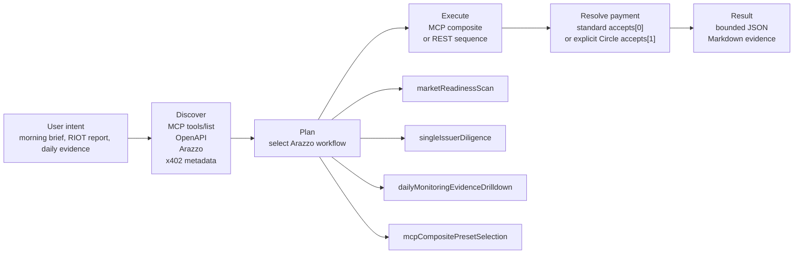

# DeltaSignal ATLAS-7 - SEC-Grounded Issuer Intelligence for Agents

[](https://api.aitrailblazer.net/mcp)
[](https://api.aitrailblazer.net/.well-known/x402)
[](https://developers.circle.com/gateway/nanopayments/quickstarts/seller.md)
[](./arazzo/deltasignal-arazzo.yaml)
[](https://github.com/aitrailblazer/deltasignal-atlas-codex-plugin/actions/workflows/discovery-contract.yml)
[](https://glama.ai/mcp/connectors/net.aitrailblazer.api/delta-signal-atlas-7)

Evidence-first issuer intelligence, SEC/XBRL signals, risk context, fundamentals, alpha screens, and Synthetic Basket pressure evidence for crypto-exposed public companies. The live public surface exposes MCP, OpenAPI, Arazzo workflows, pricing/field-contract discovery, x402 challenges for protected execution, signed wallet grant sessions, and ATLAS-7 audit status.

Common workflows are exposed as composite MCP presets so agents can call one reliable tool instead of hand-orchestrating several low-level calls. The live Azure service also exposes an operator audit-status tool so agents can verify that the full 215-issuer regression run is healthy before relying on the surface.

Native MCP server plus x402 micropayments. Public clients should not request or store Delta Signal API keys. Standard Base x402 is the compatibility-first challenge at `accepts[0]`; Circle Gateway is an explicitly selectable optimized path at `accepts[1]` for Circle-aware clients using `GatewayWalletBatched`. Signed wallet grants are separate backend virtual credit and do not settle on-chain.

Agents discover, pay, and execute deterministic workflows through MCP tools, OpenAPI routes, and Arazzo scenario definitions.

Also available as a [Glama Connector](https://glama.ai/mcp/connectors/net.aitrailblazer.api/delta-signal-atlas-7). Smithery remains available as an alternate connector path.

## July 15 Live Contract Checkpoint

The latest verified public contract exposes **68 OpenAPI paths**, **81 MCP tools**, **30 priced routes**, and **47 parser-contract fields**. The MCP catalog includes **26 governed `atlas7_*` semantic tools** for model/field discovery, validated semantic queries, evidence lineage, issuer reports, history, pressure, and readiness.

The current Level 2 calculation universe contains **378 issuers**: 215 crypto-canonical issuers plus 163 expanded public-equity issuers. The July 15 CompanyFacts/PIT replay completed all 378 issuers and materialized **817,992 rows with 0 errors**. The separate customer-route regression audit covered 215 issuers and 1,935 operations: **1,923 successful, 0 failed, 0 skipped, and 12 not applicable**.

For governed semantic access, inspect `atlas7_model_catalog` and `atlas7_field_catalog` before compiling or executing a semantic query. Treat returned evidence envelopes as the source boundary; raw SQL is never part of the public contract.

## Circle Agent Marketplace Review Focus

Delta Signal ATLAS-7 should be reviewed as an x402-compatible seller service for AI agents, not as a generic chat plugin or API-key product.

The public review surface is ATLAS-7 issuer intelligence:

- MCP discovery before paid execution.
- OpenAPI route contracts with reachable REST routes and 402 response behavior.
- Arazzo workflow metadata for bounded scenario planning.
- x402 challenge and retry behavior through Base USDC.
- Circle Gateway metadata through `GatewayWalletBatched` for Circle-aware clients.
- Route-level pricing and payment metadata.
- Per-call receipt metadata for paid-call reconciliation.
- Evidence-preserving JSON or Markdown outputs with source dates, caveats, quality flags, payload mode, route provenance, and non-advice boundaries.

Recommended reviewer path:

1. Inspect `https://api.aitrailblazer.net/.well-known/x402`.
2. Inspect MCP `tools/list` before any paid call.
3. Inspect `https://api.aitrailblazer.net/openapi.json`.
4. Probe `GET https://api.aitrailblazer.net/v1/readiness`.
5. Confirm that a plain unauthenticated paid route may return HTTP `402 Payment Required`.
6. Confirm the challenge presents standard Base x402 at `accepts[0]` and, where configured, Circle Gateway `GatewayWalletBatched` at `accepts[1]`.
7. Let first-entry clients use the standard requirement, or explicitly select Circle by capability/provider pin from a Circle-aware client.
8. Inspect returned evidence, billing, and receipt metadata before trusting rendered prose.

Marketplace reviewers should validate a public x402 resource, seller `payTo`, amount/network/asset metadata, standard x402 compatibility, explicit Circle Gateway `GatewayWalletBatched` selection for Circle-aware clients, and the absence of broker, wallet, settlement-service, or investment-advice claims. A Circle test wallet must have deposited or available Gateway balance; an ERC-20 USDC balance on Base alone is not sufficient for Gateway settlement.

TripCode / River subscriber research is visible in public MCP discovery, but execution is x402/grant-gated and evidence-dependent. Do not promise a successful TripCode/River answer unless the live tool call resolves the required River / issuer index blobs.

## How Agents Know and Run Workflows

The public landing page includes the animated workflow runner. The same contract is machine-readable here:



Agents do not need a special Arazzo runner to use this today. MCP clients can read the scenario definitions, select one of the exposed MCP composite tools, or follow the OpenAPI route sequence step by step. Public clients should use x402 challenge/retry or signed wallet grant sessions. Internal API keys are first-party operations credentials and are not part of the public integration path.

## Key Surfaces

- **Changelog** - [`changelog.html`](./changelog.html)
- **Changelog feeds** - [`rss.xml`](./rss.xml) and [`atom.xml`](./atom.xml)
- **Claude Code project guide** - [`CLAUDE.md`](./CLAUDE.md)
- **MCP endpoint** - `https://api.aitrailblazer.net/mcp`
- **Main website** - `https://aitrailblazer.github.io/deltasignal-atlas-codex-plugin/`
- **StrategiX Visual MCP** - `https://aitrailblazer.github.io/strategix-visual-mcp/`
- **Delta Signal Substack** - `https://substack.com/@deltasignalai`
- **OpenAPI 3.1** - `https://api.aitrailblazer.net/openapi.json`
- **x402 discovery** - `https://api.aitrailblazer.net/.well-known/x402`
- **Arazzo YAML** - [`arazzo/deltasignal-arazzo.yaml`](./arazzo/deltasignal-arazzo.yaml) and root mirror [`deltasignal-arazzo.yaml`](./deltasignal-arazzo.yaml)
- **Arazzo JSON** - [`arazzo/deltasignal-arazzo.json`](./arazzo/deltasignal-arazzo.json) and root mirror [`deltasignal-arazzo.json`](./deltasignal-arazzo.json)
- **Public handshake workflow** - [`arazzo/publicMcpX402Handshake.arazzo.yaml`](./arazzo/publicMcpX402Handshake.arazzo.yaml)
- **Executable Circle-aware buyer** - [setup instructions](./examples/circle-aware-buyer/README.md) and [buyer source](./examples/circle-aware-buyer/buyer.mjs)
- **Glama Connector** - [`net.aitrailblazer.api/delta-signal-atlas-7`](https://glama.ai/mcp/connectors/net.aitrailblazer.api/delta-signal-atlas-7)
- **Registry refresh notes** - [`REGISTRY_REFRESH.md`](./REGISTRY_REFRESH.md)

## Changelog Feed Maintenance

`rss.xml` and `atom.xml` are generated from the machine-readable JSON embedded in [`changelog-llm.html`](./changelog-llm.html):

```bash
node scripts/generate-changelog-feeds.mjs
```

The `Changelog Feeds` GitHub Action runs on changelog pushes, daily schedule, and manual dispatch. It refreshes the feed files and commits them when they drift, while the discovery contract workflow fails if a pull request changes the changelog without regenerating the feeds.

## Quick Start

### Codex + x402

```bash
npx @coinbase/payments-mcp install
codex plugin marketplace add aitrailblazer/deltasignal-atlas-codex-plugin
```

Restart Codex CLI after install.

### Claude Code + x402

```bash
npx @coinbase/payments-mcp install --client claude-code
claude mcp add --transport http deltasignal-atlas-7 https://api.aitrailblazer.net/mcp
```

### Test Immediately

```text
Give me a DeltaSignal morning brief.
Run a DeltaSignal company report for RIOT.
Show me the DeltaSignal pressure board.
Run a quick ticker check for MARA.
Is the full ATLAS-7 audit healthy?
```

## Seven Agent Workflows

The workflow layer is published as Arazzo `1.0.1`:

- YAML: [`arazzo/deltasignal-arazzo.yaml`](./arazzo/deltasignal-arazzo.yaml)
- JSON: [`arazzo/deltasignal-arazzo.json`](./arazzo/deltasignal-arazzo.json)
- Public handshake only: [`arazzo/publicMcpX402Handshake.arazzo.yaml`](./arazzo/publicMcpX402Handshake.arazzo.yaml)

These workflows are scenario guidance for agents. They do not replace OpenAPI or MCP; they tell an agent which operations/tools to call for a user intent.

### 1. `publicMcpX402Handshake`

Public onboarding and payment check.

Flow:

1. Call `POST /mcp` with JSON-RPC `tools/list`.
2. Do not send an internal key.
3. Expect HTTP `200` with the public DeltaSignal tool inventory.
4. Call a real tool such as `deltasignal_readiness` through the x402-capable client.
5. Expect either a signed wallet grant-session token to allow execution or HTTP `402 Payment Required`. Public grant access uses enrolled EVM wallets: `GET /v1/grant/challenge`, sign the returned message, `POST /v1/grant/session`, then attach `X-DeltaSignal-Grant-Token`. The backend maps that wallet to database-managed grant budget/runway records. Active grant contexts may expose `grant_expires_at` / `grant_expires_in_seconds` for the grant window; challenge/session `expires_at` fields remain short TTLs.
6. If challenged, let the x402-capable client pay and retry the same `tools/call` request.

Use this to confirm public MCP discovery and paid tool execution before real use.

### 2. `publicRestX402DailyClient`

Deterministic REST clients can run the same evidence workflows without handling API keys.

Flow:

1. Read `GET /v1/pricing` and `GET /v1/contract/fields`.
2. Run `GET /v1/readiness` through an x402-capable client.
3. If the route returns `402 Payment Required`, settle through the x402 client and retry with proof.
4. If the wallet is enrolled for a grant, mint a signed wallet grant session and attach `X-DeltaSignal-Grant-Token` instead of paying on-chain.
5. Store the response evidence metadata, billing metadata, grant runway fields, caveats, and non-advice boundary with each call.

Use this for Node, Go, .NET, cron, and data-pipeline integrations that do not need an agent runtime.

### 3. `atlas7AuditStatusCheck`

Operator readiness check for the scheduled Azure-native regression audit.

Flow:

1. Call MCP tool `deltasignal_atlas7_audit_status` through the paid/grant/internal MCP flow, or call `GET /v1/atlas7/audit/latest` with an internal/pre-authorized key. The REST audit endpoint is not a plain unauthenticated public probe.
2. Confirm `status=healthy`, `stale=false`, `issuer_count=215`, `failed_count=0`, `historical_failed_count=0`, and `composite_failed_count=0`.
3. Preserve the artifact prefix and `finished_at_utc` when summarizing.

This workflow is an operational audit surface, not a paid issuer-analysis route.

### 4. `marketReadinessScan`

Broad market operating picture.

Flow:

1. `GET /v1/readiness`
2. `GET /v1/risk-distribution`
3. `GET /v1/top-stressed?limit=10`
4. `GET /v1/alpha-opportunities?limit=10`

Use this when a user asks what is happening across the crypto public issuer universe.

### 5. `singleIssuerDiligence`

Full ticker-level diligence.

Flow:

1. `GET /v1/company-fundamentals/{ticker}`
2. `GET /v1/alpha-signals/{ticker}`
3. `GET /v1/covenant-stress/{ticker}`
4. `GET /v1/peer-ranking/{ticker}`
5. Optional: `GET /v1/atlas-history/{ticker}?limit=30`

MCP equivalent: call `deltasignal_company_report` with `{ "ticker": "RIOT" }`.

### 6. `dailyMonitoringEvidenceDrilldown`

Compact daily monitoring first, raw evidence only when requested.

Flow:

1. `GET /v1/daily-changes/latest`
2. Optional: `GET /v1/daily-changes/evidence?ticker={ticker}&source_date={source_date}&limit=25`

Use this when a user asks what changed today, then asks why a specific issuer moved.

### 7. `mcpCompositePresetSelection`

Preferred MCP composite tools for common user intents.

| Preset | Intent | Price metadata |
| --- | --- | --- |
| `deltasignal_morning_brief` | Daily market scan | `$0.18` |
| `deltasignal_company_report` | Full single-ticker diligence | `$0.60` standard display; `$0.45-$0.75` route-declared range |
| `deltasignal_pressure_board` | Risk-focused monitoring | `$0.14` |
| `deltasignal_alpha_sweep` | Opportunity-focused market screen | `$0.14` |
| `deltasignal_quick_ticker_check` | Fast single-name sanity check | `$0.18` |

Agents should prefer these server-enforced composites for common scenarios instead of manually fanning out low-level tools.

### 8. `tripCodeResearchContinuity`

Article-to-evidence continuity for DeltaSignal subscribers.

Marketplace caveat: this workflow is discovery-gated. Do not claim it is public marketplace-ready unless the deployed MCP `tools/list` exposes the TripCode tools and the required River / issuer index blobs are available. If discovery does not expose these tools, use the supported ATLAS-7 issuer workflow instead.

Flow:

1. Read the `ATLAS-7 TripCode: TF-SUB-...` value from a DeltaSignal article subtitle.
2. Call MCP tool `deltasignal_resolve_article_tripcode` with that TripCode.
3. Use returned `continuity.linked_xbrl_tripcodes`, `linked_ds_tripcodes`, and `river_tripcodes` to load filing evidence, computed DeltaSignal signals, and issuer thesis River context.
4. If a draft article is being prepared before publication, call `deltasignal_generate_article_tripcode` with DeltaSignal research identity fields. Do not use a Substack post ID as canonical identity.
5. If the user asks for the full subscriber thesis map and prior article nodes are not already provided, call `deltasignal_list_article_tripcodes` with the current TripCode, TF-RIVER TripCode, or issuer symbol to discover prior TF-SUB nodes automatically.
6. Call `deltasignal_resolve_river_tripcode` when the user wants the full persistent River graph, or `deltasignal_reverse_search_river` when the user wants thesis-lineage reconstruction.
7. Call `deltasignal_article_thesis_map` with the current article TripCode and the discovered River/evidence continuity. Do not require the subscriber to paste old TripCodes by hand.
8. If the article names filing evidence only, call `deltasignal_resolve_filing_tripcode`, then `deltasignal_compare_article_to_filing_evidence` for a compact verification packet.

Use this when a subscriber asks Codex or Claude Code to turn a DeltaSignal article into a machine-readable thesis map.

Public subscriber access is through MCP/x402:

1. Discovery is free: plugin page, `tools/list`, OpenAPI, Arazzo, `llms.txt`, and `.well-known/x402`.
2. Public `tools/call` may require a signed wallet grant session or x402 payment proof.
3. x402-compatible clients receive a 402 challenge, pay through Base USDC, then retry the same request.
4. Full paid article text and LLM-friendly Markdown are entitlement-gated. If access is not verified, tools should return metadata, permitted summaries, continuity links, and `restricted` or `missing` status rather than leaking paid content.
5. Internal authoring write tools are not exposed publicly.

## Available MCP Tools

Composite presets:

- `deltasignal_morning_brief`
- `deltasignal_company_report`
- `deltasignal_pressure_board`
- `deltasignal_alpha_sweep`
- `deltasignal_quick_ticker_check`

Granular tools:

- `deltasignal_readiness`

Discovery-gated TripCode / River tools. Call only when live MCP `tools/list` exposes them:

- `deltasignal_generate_article_tripcode` - authoring-time TF-SUB identity generation; local, deterministic, typical price $0.00.
- `deltasignal_resolve_article_tripcode` - resolves an article subtitle TripCode into the Azure Blob research object; typical price $0.02.
- `deltasignal_list_article_tripcodes` - discovers prior TF-SUB article nodes from a current article TripCode, River TripCode, or issuer symbol; typical price $0.02.
- `deltasignal_resolve_river_tripcode` - resolves a TF-RIVER issuer thesis graph from Azure Blob; typical price $0.05.
- `deltasignal_reverse_search_river` - reconstructs River thesis lineage and the eight-section subscriber map from an issuer, TripCode, or claim; typical price $0.30.
- `deltasignal_search_by_claim` - searches River claim records by query or claim hash; typical price $0.05.
- `deltasignal_search_by_issuer` - discovers the issuer index, active River root, and article nodes; typical price $0.05.
- `deltasignal_compare_claim_to_evidence` - compares one claim to River evidence refs and marks missing evidence explicitly; typical price $0.08.
- `deltasignal_generate_filing_tripcode` - generates a TF-XBRL evidence identity from SEC/XBRL tuple data; local, deterministic, typical price $0.00.
- `deltasignal_resolve_filing_tripcode` - resolves known TF-XBRL filing evidence; typical price $0.02.
- `deltasignal_compare_article_to_filing_evidence` - compares one article node to linked filing evidence; typical price $0.08.
- `deltasignal_article_thesis_map` - resolves one article-centered River into the eight-section subscriber thesis map; typical price $0.30.

Public ATLAS-7 issuer tools:

- `deltasignal_top_stressed`
- `deltasignal_covenant_stress`
- `deltasignal_peer_ranking`
- `deltasignal_alpha_signals`
- `deltasignal_company_fundamentals`
- `deltasignal_risk_distribution`
- `deltasignal_daily_changes` - compact Daily Monitoring; no raw tag arrays; typical public route price $0.03.
- `deltasignal_daily_change_evidence` - explicit issuer proof drilldown; paginated raw Company Facts tags; typical public route price $0.03.
- `deltasignal_atlas7_audit_status` - operator health check for the Azure-native 215-issuer ATLAS-7 regression audit; reports freshness, artifact prefix, operation count, historical failures, composite failures, and health state. This is a readiness/audit surface, not an issuer-analysis route.

All tools are read-only, schema-validated, and bounded for agent use.

## TripCode Resolver Pricing

TripCode tools are MCP-first research-continuity utilities. They are priced to make subscriber article resolution cheap while keeping higher-value synthesis separate.

Public marketplace caveat: TripCode / River tools are discoverable in public MCP, but execution is x402/grant-gated and depends on deployed River / issuer index blobs. The strongest Circle Agent Marketplace path today is ATLAS-7 x402 issuer intelligence: Readiness, Morning Brief, Company Report, Pressure Board, Alpha Sweep, Quick Ticker Check, Synthetic Basket pressure, and issuer drilldowns.

| MCP tool | Typical price | Purpose |
| --- | ---: | --- |
| `deltasignal_generate_article_tripcode` | `$0.00` | Generate a deterministic TF-SUB article/research identity before publication |
| `deltasignal_resolve_article_tripcode` | `$0.02` | Resolve an article subtitle TripCode into its Azure Blob research object |
| `deltasignal_list_article_tripcodes` | `$0.02` | Discover prior TF-SUB nodes from a current article, TF-RIVER, or issuer River |
| `deltasignal_resolve_river_tripcode` | `$0.05` | Resolve the persistent TF-RIVER issuer thesis graph |
| `deltasignal_reverse_search_river` | `$0.30` | Reconstruct thesis deltas, confirmations, weakened assumptions, risks, scenarios, and monitors |
| `deltasignal_search_by_claim` | `$0.05` | Search River claims by normalized claim text or hash |
| `deltasignal_search_by_issuer` | `$0.05` | Find issuer index, active River root, and TF-SUB article nodes |
| `deltasignal_compare_claim_to_evidence` | `$0.08` | Compare one claim to River evidence refs and preserve missing evidence |
| `deltasignal_generate_filing_tripcode` | `$0.00` | Generate a deterministic TF-XBRL identity from supplied SEC/XBRL tuple data |
| `deltasignal_resolve_filing_tripcode` | `$0.02` | Resolve a TF-XBRL filing evidence object |
| `deltasignal_compare_article_to_filing_evidence` | `$0.08` | Return a compact article-to-filing verification packet |
| `deltasignal_article_thesis_map` | `$0.30` | Resolve one article-centered River into a current thesis map |
| Future deep River synthesis | `$0.75-$1.20` | Heavier multi-River synthesis across article, evidence, computed signals, and milestones |

## Natural Language Briefs

Raw and composite routes return structured evidence. Natural Language routes compile that evidence into validated Markdown while preserving source dates, caveats, quality flags, evidence hashes, and non-advice disclaimers.

Current public routes:

- `top_stressed_natural` - live, `$0.95`, evidence-preserving Markdown brief for highest-stress issuers.
- `morning_brief_natural` - live, `$0.95`, backend-composed Natural Language Morning Brief.

Planned routes:

- `covenant_stress_natural` - `$1.20`

## Access Model

- Public MCP endpoint: `https://api.aitrailblazer.net/mcp`
- Public OpenAPI: `https://api.aitrailblazer.net/openapi.json`
- Public x402 discovery: `https://api.aitrailblazer.net/.well-known/x402`
- Base x402 routes: `https://api.aitrailblazer.net/v1/*`
- Payment rail: Base USDC through x402-capable clients; standard x402 is `accepts[0]` for compatibility and Circle Gateway is an explicit additive option at `accepts[1]` for clients that support `GatewayWalletBatched`
- Seller `payTo`: `0x6D91ADF2c545047cbbC5b37a5f457cce081B48d3`

Public clients do not need Delta Signal API keys. First calls may be grant-covered when the caller wallet is enrolled in the backend grant database. Public grant access uses the wallet grant-session flow for enrolled EVM wallets: `GET /v1/grant/challenge`, sign the returned message, `POST /v1/grant/session`, then attach `X-DeltaSignal-Grant-Token`. Raw unsigned wallet headers do not unlock grants. Grant-covered calls are virtual backend credit and do not settle. If no active grant applies, compatible clients receive x402 payment requirements and retry with payment proof. If payment tooling is unavailable, inspect the route and expected cost, then retry through a standard x402-capable client or a Circle-aware client that can select `GatewayWalletBatched`.

## Public x402 Probe

Before paid use, inspect the payment contract. A plain unauthenticated request may return HTTP `402`; a compatible client with a configured identity grant or signed wallet grant may execute under that grant:

```text
GET https://api.aitrailblazer.net/v1/readiness
```

Expected public behavior:

- HTTP `402 Payment Required`
- `x402Version=2`
- `network=eip155:8453`
- Base USDC settlement
- standard x402 option first for broad compatibility
- optional Circle Gateway `GatewayWalletBatched` option for Circle-aware clients
- seller `payTo=0x6D91ADF2c545047cbbC5b37a5f457cce081B48d3`
- payment metadata for the route, including Circle Gateway metadata when available

Paid responses should include response-envelope billing metadata and, where applicable, a per-call settlement receipt. For standard `x402_direct`, reconcile wallet movement plus the response receipt. For Circle Gateway batching, the response receipt is the per-call attribution surface and should preserve route, quoted cost, charged or attributed amount, settlement mode, payer reference, reconciliation key, batch or transaction reference when available, timestamp, status, and quality flags.

Circle selection is capability-based, not automatic fallback. A plain EIP-3009 client may use the first standard requirement without Circle support. A Circle-aware buyer must explicitly select the `GatewayWalletBatched` requirement and sign against the Gateway domain and challenge-provided `extra.verifyingContract`. The signing wallet must also have deposited or available Circle Gateway balance; Base ERC-20 USDC alone can produce a closed `insufficient_balance` response with no charge.

Do not claim Circle Agent Marketplace listing status until Circle or the Circle marketplace UI confirms the branded Delta Signal ATLAS-7 listing.

## Daily Monitoring, Evidence, and Export Packaging

DeltaSignal daily activity is split into separate products:

- **Morning Brief** answers "give me the daily picture" with one backend-composed scan across readiness, latest meaningful deltas, risk distribution, top stressed issuers, and alpha opportunities.
- **Finished Morning Brief PDF** uses StrategiX Visual MCP to package DeltaSignal evidence into a polished, branded, auditable PDF. Recommended workflow: `strategix_delta_brief_pdf_full` at `$4.50` per market day.
- **Monthly PDF Subscription** is `$79` for 22 daily briefs with auto-delivery and archive access.
- **Heavy / Multi-Issuer Deep Brief** is `$9.00` when the finished PDF includes extra issuer drilldowns.
- **Daily Monitoring** answers "what changed today?" through compact MCP and REST responses with freshness, changed-company rows, source dates, and evidence references.
- **Evidence Drilldown** answers "show me why this issuer moved" through `deltasignal_daily_change_evidence` or `GET /v1/daily-changes/evidence`.
- **Bulk Export** is reserved for future artifact-backed full daily evidence packs; full exports should be saved as durable files, not pasted into chat context.

Public REST and payment surfaces:

- `GET /v1/daily-changes/latest` or `GET /mpp/v1/daily-changes/latest` - compact monitoring.
- `GET /v1/daily-changes/evidence` or `GET /mpp/v1/daily-changes/evidence` - issuer evidence drilldown.
- `GET /v1/atlas7/audit/latest` - authenticated operator REST status for the latest 215-issuer Azure regression audit. Public agents should prefer MCP `deltasignal_atlas7_audit_status` through the paid/grant/internal MCP flow.
- Future bulk evidence export proposal: small pack $0.15, standard pack $0.30, full daily export $0.75-$1.50.

## Development Modes

- Local: `DELTASIGNAL_PAYMENT_MODE=local`
- Live production: `DELTASIGNAL_PAYMENT_MODE=live`
- Internal smoke: `DELTASIGNAL_PAYMENT_MODE=internal` with a pre-authorized key

Internal mode is for first-party validation only. Public users should use x402.

## Technical

- Bundled STDIO MCP server in `mcp-stdio/`
- Remote MCP endpoint: `https://api.aitrailblazer.net/mcp`
- OpenAPI surface: `https://api.aitrailblazer.net/openapi.json`
- Arazzo workflow definitions: [`arazzo/deltasignal-arazzo.yaml`](./arazzo/deltasignal-arazzo.yaml) and [`arazzo/deltasignal-arazzo.json`](./arazzo/deltasignal-arazzo.json)
- Strict input validation and bounded responses
- Compatible with Codex, Claude Code, OpenClaw, and other MCP clients

Discovery contract validation:

```bash
cd mcp-stdio
go run ./cmd/validate-discovery --root ..
```

Set `DELTASIGNAL_API_KEY` or pass `--api-key` to also verify that every Arazzo `x-mcp-tool` exists in live MCP `tools/list`.
