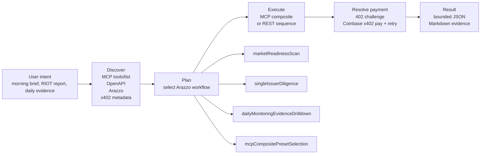

# DeltaSignal ATLAS-7 - SEC-Grounded Issuer Intelligence for Agents

[](https://api.aitrailblazer.net/mcp)
[](https://api.aitrailblazer.net/.well-known/x402)
[](./arazzo/deltasignal-arazzo.yaml)
[](https://glama.ai/mcp/connectors/net.aitrailblazer.api/delta-signal-atlas-7)

Real-time financial signals, risk, fundamentals, and alpha for crypto-exposed public companies.

Native MCP server plus x402 micropayments. First 5 calls are free where supported, then Base USDC through compatible x402 clients. No subscription required.

Agents discover, pay, and execute deterministic workflows through MCP tools, OpenAPI routes, and Arazzo scenario definitions.

Also available as a [Glama Connector](https://glama.ai/mcp/connectors/net.aitrailblazer.api/delta-signal-atlas-7). Smithery remains available as an alternate connector path.

## How Agents Know and Run Workflows

The public landing page includes the animated workflow runner. The same contract is machine-readable here:



Agents do not need a special Arazzo runner to use this today. MCP clients can read the scenario definitions, select one of the exposed MCP composite tools, or follow the OpenAPI route sequence step by step. Public clients use x402 when a route returns `402 Payment Required`; internal keyed validation is first-party testing only.

## Key Surfaces

- **MCP endpoint** - `https://api.aitrailblazer.net/mcp`
- **OpenAPI 3.1** - `https://api.aitrailblazer.net/openapi.json`
- **x402 discovery** - `https://api.aitrailblazer.net/.well-known/x402`
- **Arazzo YAML** - [`arazzo/deltasignal-arazzo.yaml`](./arazzo/deltasignal-arazzo.yaml) and root mirror [`deltasignal-arazzo.yaml`](./deltasignal-arazzo.yaml)
- **Arazzo JSON** - [`arazzo/deltasignal-arazzo.json`](./arazzo/deltasignal-arazzo.json) and root mirror [`deltasignal-arazzo.json`](./deltasignal-arazzo.json)
- **Public handshake workflow** - [`arazzo/publicMcpX402Handshake.arazzo.yaml`](./arazzo/publicMcpX402Handshake.arazzo.yaml)
- **Glama Connector** - [`net.aitrailblazer.api/delta-signal-atlas-7`](https://glama.ai/mcp/connectors/net.aitrailblazer.api/delta-signal-atlas-7)

## Quick Start

### Codex + Coinbase

```bash
npx @coinbase/payments-mcp install
codex plugin marketplace add aitrailblazer/deltasignal-atlas-codex-plugin
```

Restart Codex CLI after install.

### Claude Code + Coinbase

```bash
npx @coinbase/payments-mcp install --client claude-code
claude mcp add --transport http deltasignal-atlas-7 https://api.aitrailblazer.net/mcp
```

### Test Immediately

```text
Give me a DeltaSignal morning brief.
Run a DeltaSignal company report for RIOT.
Show me the DeltaSignal pressure board.
Run a quick ticker check for MARA.
```

## Six Agent Workflows

The workflow layer is published as Arazzo `1.0.1`:

- YAML: [`arazzo/deltasignal-arazzo.yaml`](./arazzo/deltasignal-arazzo.yaml)
- JSON: [`arazzo/deltasignal-arazzo.json`](./arazzo/deltasignal-arazzo.json)
- Public handshake only: [`arazzo/publicMcpX402Handshake.arazzo.yaml`](./arazzo/publicMcpX402Handshake.arazzo.yaml)

These workflows are scenario guidance for agents. They do not replace OpenAPI or MCP; they tell an agent which operations/tools to call for a user intent.

### 1. `publicMcpX402Handshake`

Public onboarding and payment check.

Flow:

1. Call `POST /mcp` with JSON-RPC `tools/list`.
2. Do not send an internal key.
3. Expect HTTP `402 Payment Required`.
4. Let the x402-capable client pay and retry the same MCP request.

Use this to confirm public paid MCP behavior before tool execution.

### 2. `internalMcpToolSmoke`

First-party internal no-payment smoke on the same MCP endpoint.

Flow:

1. Call `POST /mcp tools/list` with `x-api-key` or `mcp-api-key`.
2. Expect HTTP `200`.
3. Confirm the tool inventory.
4. Call `deltasignal_readiness`.

This workflow is internal validation only. Public users should use x402.

### 3. `marketReadinessScan`

Broad market operating picture.

Flow:

1. `GET /v1/readiness`
2. `GET /v1/risk-distribution`
3. `GET /v1/top-stressed?limit=10`
4. `GET /v1/alpha-opportunities?limit=10`

Use this when a user asks what is happening across the crypto public issuer universe.

### 4. `singleIssuerDiligence`

Full ticker-level diligence.

Flow:

1. `GET /v1/company-fundamentals/{ticker}`
2. `GET /v1/alpha-signals/{ticker}`
3. `GET /v1/covenant-stress/{ticker}`
4. `GET /v1/peer-ranking/{ticker}`
5. Optional: `GET /v1/atlas-history/{ticker}?limit=30`

MCP equivalent: call `deltasignal_company_report` with `{ "ticker": "RIOT" }`.

### 5. `dailyMonitoringEvidenceDrilldown`

Compact daily monitoring first, raw evidence only when requested.

Flow:

1. `GET /v1/daily-changes/latest`
2. Optional: `GET /v1/daily-changes/evidence?ticker={ticker}&source_date={source_date}&limit=25`

Use this when a user asks what changed today, then asks why a specific issuer moved.

### 6. `mcpCompositePresetSelection`

Preferred MCP composite tools for common user intents.

| Preset | Intent | Price metadata |
| --- | --- | --- |
| `deltasignal_morning_brief` | Daily market scan | `$0.18` |
| `deltasignal_company_report` | Full single-ticker diligence | `$0.30` |
| `deltasignal_pressure_board` | Risk-focused monitoring | `$0.14` |
| `deltasignal_alpha_sweep` | Opportunity-focused market screen | `$0.14` |
| `deltasignal_quick_ticker_check` | Fast single-name sanity check | `$0.18` |

Agents should prefer these server-enforced composites for common scenarios instead of manually fanning out low-level tools.

## Available MCP Tools

Composite presets:

- `deltasignal_morning_brief`
- `deltasignal_company_report`
- `deltasignal_pressure_board`
- `deltasignal_alpha_sweep`
- `deltasignal_quick_ticker_check`

Granular tools:

- `deltasignal_readiness`
- `deltasignal_top_stressed`
- `deltasignal_covenant_stress`
- `deltasignal_peer_ranking`
- `deltasignal_alpha_signals`
- `deltasignal_company_fundamentals`
- `deltasignal_risk_distribution`
- `deltasignal_daily_changes`
- `deltasignal_daily_change_evidence`

All tools are read-only, schema-validated, and bounded for agent use.

## Natural Language Briefs

Raw and composite routes return structured evidence. Natural Language routes compile that evidence into validated Markdown while preserving source dates, caveats, quality flags, evidence hashes, and non-advice disclaimers.

Current public routes:

- `top_stressed_natural` - live, `$0.95`, evidence-preserving Markdown brief for highest-stress issuers.
- `morning_brief_natural` - live, `$0.95`, backend-composed Natural Language Morning Brief.

Planned routes:

- `covenant_stress_natural` - `$1.20`

## Access Model

- Public MCP endpoint: `https://api.aitrailblazer.net/mcp`
- Public OpenAPI: `https://api.aitrailblazer.net/openapi.json`
- Public x402 discovery: `https://api.aitrailblazer.net/.well-known/x402`
- Base x402 routes: `https://api.aitrailblazer.net/v1/*`
- Payment rail: Base USDC through x402-capable clients
- Seller `payTo`: `0x6D91ADF2c545047cbbC5b37a5f457cce081B48d3`

First 5 calls are free where supported. After the free tier, compatible clients receive x402 payment requirements. If payment tooling is unavailable, inspect the route and expected cost, then retry through a Coinbase/x402-capable client.

## Public x402 Probe

Before paid use, inspect the payment contract without spending:

```text
GET https://api.aitrailblazer.net/v1/readiness
```

Expected public behavior:

- HTTP `402 Payment Required`
- `x402Version=2`
- `network=eip155:8453`
- Base USDC settlement
- seller `payTo=0x6D91ADF2c545047cbbC5b37a5f457cce081B48d3`
- Bazaar discovery metadata for the route

Do not claim Agentic Market first-party verification until the Agentic Market UI or Coinbase/Agentic Market team confirms the branded DeltaSignal ATLAS-7 listing.

## Daily Monitoring, Evidence, and Export Packaging

DeltaSignal daily activity is split into separate products:

- **Daily Monitoring** answers "what changed today?" through compact MCP and REST responses.
- **Evidence Drilldown** answers "show me why this issuer moved" through `deltasignal_daily_change_evidence` or `GET /v1/daily-changes/evidence`.
- **Bulk Export** is reserved for future artifact-backed full daily evidence packs; full exports should be saved as durable files, not pasted into chat context.

Public REST and payment surfaces:

- `GET /v1/daily-changes/latest` or `GET /mpp/v1/daily-changes/latest` - compact monitoring.
- `GET /v1/daily-changes/evidence` or `GET /mpp/v1/daily-changes/evidence` - issuer evidence drilldown.

## Development Modes

- Local: `DELTASIGNAL_PAYMENT_MODE=local`
- Live production: `DELTASIGNAL_PAYMENT_MODE=live`
- Internal smoke: `DELTASIGNAL_PAYMENT_MODE=internal` with a pre-authorized key

Internal mode is for first-party validation only. Public users should use x402.

## Technical

- Bundled STDIO MCP server in `mcp-stdio/`
- Remote MCP endpoint: `https://api.aitrailblazer.net/mcp`
- OpenAPI surface: `https://api.aitrailblazer.net/openapi.json`
- Arazzo workflow definitions: [`arazzo/deltasignal-arazzo.yaml`](./arazzo/deltasignal-arazzo.yaml) and [`arazzo/deltasignal-arazzo.json`](./arazzo/deltasignal-arazzo.json)
- Strict input validation and bounded responses
- Compatible with Codex, Claude Code, OpenClaw, and other MCP clients
